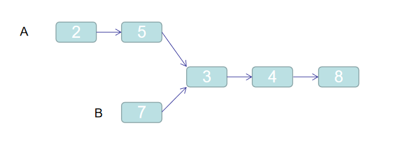

# 两个链表的第一个公共节点
2020考研真题
## 题目描述
找到交叉链表的第一个公共节点。例如链表A：2 -> 5 -> 3 -> 4 -> 8，链表B： 7 -> 3 -> 4 -> 8，两个链表中有相同的`3`这个节点且其之后的节点**引用**均相同。如下图所示：<br/>

## 解题思路
先依次遍历两个链表以求出其长度，然后用两个指针分别指向链表头部，然后将**较长**的那个链表的指针向后移动两链表相差的长度的位置做**对齐操作**。最后依次向后移动并判定两个指针是否指向了同一个元素。
### 思路一：
```java
public class Solution {
    
    public ListNode FindFirstCommonNode(ListNode pHead1, ListNode pHead2) {

        if (pHead1 == null || pHead2 == null) {
            return null;
        }

        //用于统计 pHead1.size - pHead2.size
        int diff = 0;
        ListNode temp = pHead1;
        while (temp != null) {
            diff++;
            temp = temp.next;
        }

        temp = pHead2;
        while (temp != null) {
            diff--;
            temp = temp.next;
        }

        //对齐操作
        if (diff >= 0) {
            while (diff-- > 0) pHead1 = pHead1.next;
        } else {
            while (diff++ < 0) pHead2 = pHead2.next;
        }

        //同步后移寻找公共节点
        while (pHead1 != null && pHead2 != null) {
            if (pHead1 == pHead2) {
                return pHead1;
            }
            pHead1 = pHead1.next;
            pHead2 = pHead2.next;
        }
        return null;
    }
}
```

## Code
[code](../code/Test35.java)<br/>

