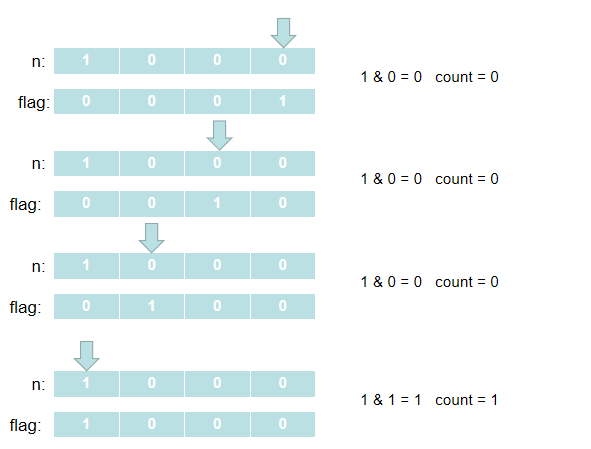

# 二进制中1的个数
进制转化，补码反码原理
## 题目描述
输入一个整数，输出该数二进制表示中**1**的个数。其中负数用补码表示。
## 解题思路
核心思想是通过`&` **位运算**来解决问题。
### 思路一：
通过一个`flag`**与`n`的每一位去做位运算**，并通过结果计算**1**的个数。<br/>
这里**还有一个值得注意的地方**，就是`flag`为`0`的原因，`int`类型默认是**32**位的，所以在**连续左移32次之后`flag`就会变为0了**。（已亲测）<br/>
下面以`n`为**8**为例来做一个图解：<br/>

```java
public class Solution {
    public int NumberOf1(int n) {
        int count = 0;
        int flag = 1;
        while (flag != 0) {
            if ((n & flag) != 0) {
                count++;
            }
            flag = flag << 1;
        }
        return count;
    }
}
```

### 思路二：
这个更为巧妙，**每次把最右边的1变为0**，剩下的就用心去感悟吧 = =。
```java
public class Solution {
    public int NumberOf1(int n) {
        int count = 0;
        while (n != 0) {
            count++;
            //把最右边的1变成0
            n = (n - 1) & n;
        }
        return count;
    }
}
```

这个真的是要献上膝盖，附上讨论区大佬的[原答案](https://www.nowcoder.com/questionTerminal/8ee967e43c2c4ec193b040ea7fbb10b8?f=discussion)链接
## Code
[code](../code/Test11.java)<br/>

