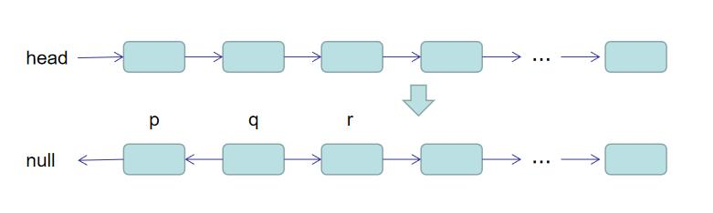

# 反转链表

## 题目描述
输入一个链表，反转链表后，输出新链表的表头。
## 解题思路
自己做完之后，又去逛了一圈讨论区，看了一下大家的思路基本都是一致：通过**一次遍历，在遍历的过程中逐渐反转链表**。
### 思路一：
首先**判空**操作；<br/>
然后创建三个节点“指针”`p`、`q`、`r`并摆好位置：<br/>
 <br/>
然后开始遍历（**`while`** 循环），每次循环三个节点一次向后移动一个，然后令`q.next = p`，直到`r`为**null**结束遍历，**此时`q`即为反转后的链表的头指针**。
```java
public class Solution {

    public ListNode ReverseList(ListNode head) {
        if (head == null || head.next == null) {
            return head;
        }
        ListNode p = head, q = head.next, r;
        p.next = null;
        r = q.next;
        q.next = p;
        while (r != null) {
            p = q;
            q = r;
            r = r.next;
            q.next = p;
        }
        return q;
    }
    
}
```

### 思路二：
这是在[讨论区](https://www.nowcoder.com/questionTerminal/75e878df47f24fdc9dc3e400ec6058ca?f=discussion)看到的，算是一个精简版本，自己也验证了一遍，为了方便理解，下面直接把注释**copy**上了。
```java
public class Solution {

    public ListNode ReverseList2(ListNode head) {
        if (head == null) {
            return head;
        }
        //head为当前节点，如果当前节点为空的话，那就什么也不做，直接返回null；
        ListNode pre = null,next;
        //当前节点是head，pre为当前节点的前一节点，next为当前节点的下一节点
        //需要pre和next的目的是让当前节点从pre->head->next1->next2变成pre<-head next1->next2
        //即pre让节点可以反转所指方向，但反转之后如果不用next节点保存next1节点的话，此单链表就此断开了
        //所以需要用到pre和next两个节点
        //1->2->3->4->5
        //1<-2<-3 4->5
        while (head != null) {
            //做循环，如果当前节点不为空的话，始终执行此循环，此循环的目的就是让当前节点从指向next到指向pre
            //如此就可以做到反转链表的效果
            //先用next保存head的下一个节点的信息，保证单链表不会因为失去head节点的原next节点而就此断裂
            next = head.next;
            //保存完next，就可以让head从指向next变成指向pre了，代码如下
            head.next = pre;
            //head指向pre后，就继续依次反转下一个节点
            //让pre，head，next依次向后移动一个节点，继续下一次的指针反转
            pre = head;
            head = next;
        }
        //如果head为null的时候，pre就为最后一个节点了，但是链表已经反转完毕，pre就是反转后链表的第一个节点
        //直接输出pre就是我们想要得到的反转后的链表
        return pre;
    }

}
```

## Code
[code](../code/Test15.java)<br/>
[kotlin Code](../../kotlin/Test15.kt)

## 相关扩展
* [**从尾到头打印链表**](从尾到头打印链表.md)
