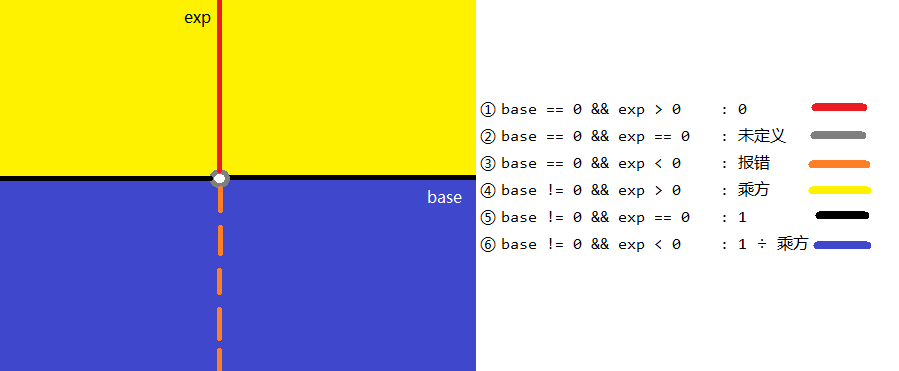

# 数值的整数次方

## 题目描述
给定一个`double`类型的浮点数**base**和`int`类型的整数**exponent**。求**base**的**exponent**次方。<br/>
保证**base**和**exponent**不同时为`0`
## 解题思路
首先我们需要把所有情况理清楚，下面借用[讨论区](https://www.nowcoder.com/questionTerminal/1a834e5e3e1a4b7ba251417554e07c00?f=discussion)的一张图：<br/>

由此可以知道，其实我更多的是需要关注**exp**的。<br/>
其次第二个需要关注的点就是**乘方**的运算了：<br/>
> 2 ^ 13 = 2^1 * 2^4 * 2^8 <br/>
> 2^1101 = 2^0001 * 2^0100 * 2^1000   (把**exp**转为二进制)<br/>

接下来的代码就好懂了，核心在`while`循环里面。
### 思路一：
```java
public class Solution {
    public double Power(double base, int exponent) {
        if (base == 0) {
            return 0;
        }
        if (exponent == 0) {
            return 1;
        }
        if (base == 0 && exponent < 0) {
            throw new RuntimeException("分母不能为0");
        }

        double result = 1.0, curBase = base;
        int n = exponent >= 0 ? exponent : -exponent;
        while (n != 0) {
            //最低（右）位为1
            if ((n & 1) == 1) {
                result *= curBase;
            }
            //每次右移之后 基数翻倍
            curBase *= curBase;
            //右移
            n >>= 1;
        }
        return exponent > 0 ? result : 1 / result;
    }

}
```


## Code
[code](../code/Test12.java)<br/>
[kotlin Code](../../kotlin/Test12.kt)

## 相关扩展
* []()
