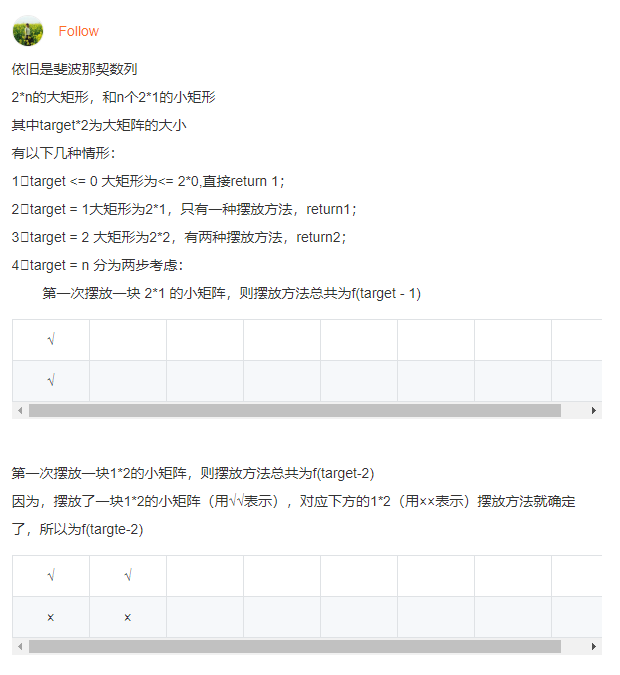

# 矩形覆盖
循环与递归
## 题目描述
我们可以用2*1的小矩形横着或者竖着去覆盖更大的矩形。请问用n个2*1的小矩形无重叠地覆盖一个2*n的大矩形，总共有多少种方法？
## 解题思路
依然是斐波那契数列，<br/>
f(0) = 0 (题目没有提示有0的情况，调了半天还以为分析的有问题 = =),<br/>
f(1) = 1,<br/>
f(2) = 2,<br/>
...<br/>
f(n) = f(n-1) + f(n-2) n > 2<br/>
评论区已经有详细的[解释]()了，这里直接附上截图：

### 思路一：
递归老套路
```java
public class Solution {
    public int RectCover(int n) {
        if (n == 1 ) return 1;
        if (n ==2) return 2;
        return RectCover(n - 1) + RectCover(n - 2);
    }
}
```

### 思路二：
```java
public class Solution {
    public int RectCover(int target) {
        if (target <= 2)return target;
        int a = 1, b = 2;
        while (target-- > 2) {
            b = a + b;
            a = b - a;
        }
        return b;
    }
}
```

## Code
[code](../code/Test10.java)<br/>

## 相关扩展
* [斐波那契数列](./斐波那契数列.md)
