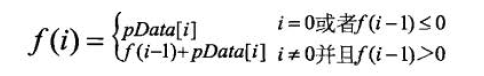

# 连续子数组的最大和

## 题目描述
HZ偶尔会拿些专业问题来忽悠那些非计算机专业的同学。今天测试组开完会后,他又发话了:在古老的一维模式识别中,常常需要计算连续子向量的最大和,当向量全为正数的时候,问题很好解决。但是,如果向量中包含负数,是否应该包含某个负数,并期望旁边的正数会弥补它呢？例如:{6,-3,-2,7,-15,1,2,2},连续子向量的最大和为8(从第0个开始,到第3个为止)。给一个数组，返回它的最大连续子序列的和，你会不会被他忽悠住？(子向量的长度至少是1)
## 解题思路
虽然题解代码都能看懂，但是细品一下又不是非常的清楚明了，只得先放一张核心图片在这里：<br/>

### 思路一：
又是一种*只可意会，言传不出*的解法 = =。 <br/>
[讨论区](https://www.nowcoder.com/questionTerminal/459bd355da1549fa8a49e350bf3df484?f=discussion)中的解题思路说 **f(i)** 代表以 **array[i]** 为末尾元素的子数组的和的最大值，但是细想一下就能发现并不是这样，但是想要自己正确的描述**f(i)**代表什么却又描述不出来，着实尴尬，这样下次再碰到类似的题又将会是一脸懵逼。。
```java
public class Solution {
    /**
     * f(i) = max( f(i-1)+array[i] , array[i] )
     * max = max( f(1) ,f(2), f(3),...,f(i) ) 
     */
    public int FindGreatestSumOfSubArray(int[] array) {
        if (array == null || array.length == 0) {
            return 0;
        }
        int max = array[0];//用于存储最大值
        int curMax = array[0]; //f(i)
        for (int i = 1; i < array.length; i++) {
            curMax = Math.max(curMax + array[i], array[i]);
            max = Math.max(max, curMax);
            System.out.printf("i = %d,curMax = %d,max = %d\n", i, curMax, max);
        }
        System.out.println(curMax);
        return max;
    }
}
```
### 思路二
**核心思路不变**，但是感觉要更容易理解一些，但是细品的话感觉又会陷进去。。
```java
public class Solution {
    public int FindGreatestSumOfSubArray(int[] array) {
        if (array == null || array.length == 0) {
            return 0;
        }
        int curSum = 0;
        int max = Integer.MIN_VALUE;
        for (int value : array) {
            if (curSum <= 0) {
                //如果当前和小于等于0，归零
                curSum = value;
            } else {
                //否则累加
                curSum += value;
            }
            //记录最大值
            max = Math.max(curSum, max);
        }
        return max;
    }
}
```

## Code
[code](../code/Test30.java)<br/>
